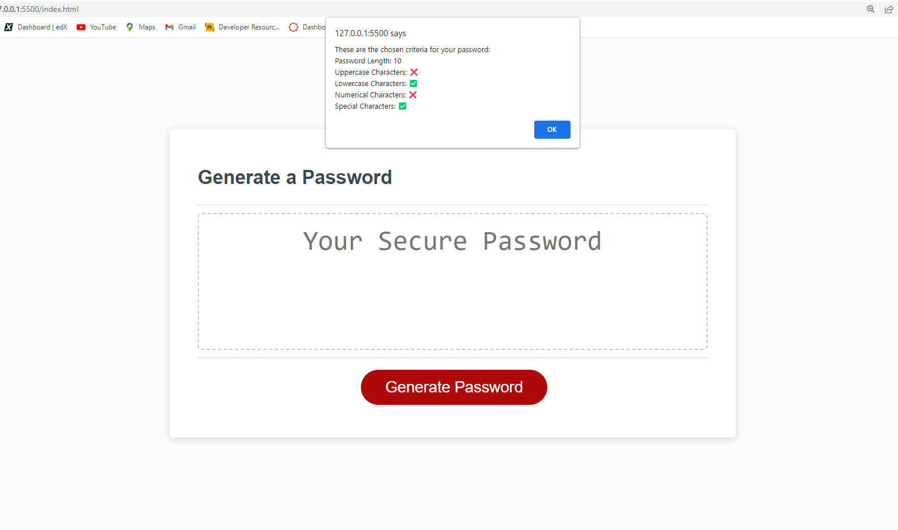

# Week-Three-Challenge
UCI bootcamp week three challenge, a random password generator.
## Project Description
The objective for this project was to create an application that generates a random secure password from given criteria input by the user.
Given starter code that provided basic html and css stylings, the functionality of the password generator was to be created in javaScript.
It was important to take what we had learned from class about objects, variables, arrrays, and functions to create the necessary logic of the application when given user input.
Given a length and instructions on which types of characters the user would like to use, this application will create a randomly generated password meeting their criteria.

## Credits
The starter code for this application was given to me in the class repository.

## Deployment

https://carechiga.github.io/Week-Three-Challenge/

